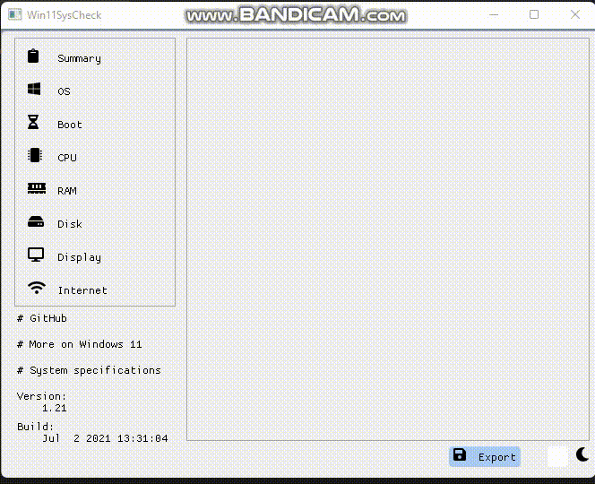

# Win11SysCheck
Windows 11 compability check software with user friendly output

----

## Contributing
* Fork it(https://github.com/mq1n/Win11SysCheck/fork)
* Create your feature branch: "git checkout -b my-new-feature".
* Commit your changes: "git commit -am 'Add some feature'".
* Push to the branch: "git push origin my-new-feature".
* Submit a pull request.

## License

Win11SysCheck is free and open source software, it is using the [GPL-3.0 license](https://github.com/mq1n/Win11SysCheck/blob/main/LICENSE)
